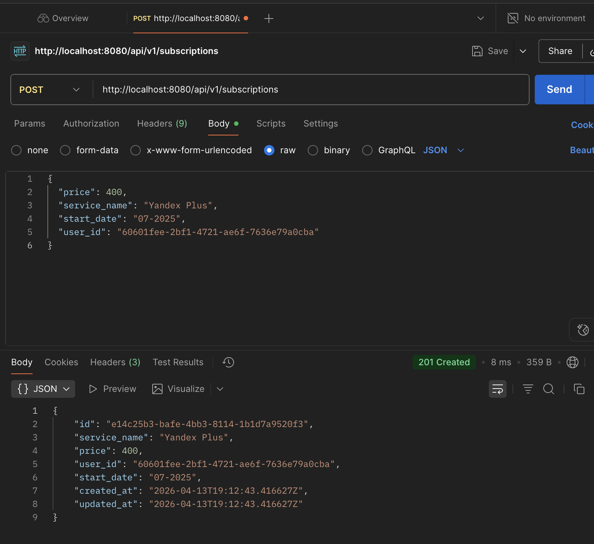
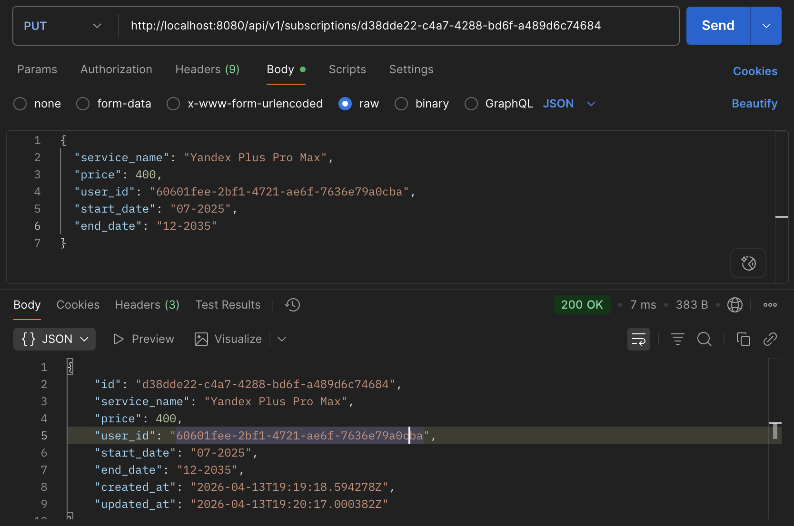

# Subscriptions REST API (Effective Mobile test task)

Go REST-сервис для CRUDL-операций над подписками и подсчёта суммарной стоимости за период. Хранилище — PostgreSQL, миграции — `golang-migrate`, конфигурация — переменные окружения и опционально `config.yaml`, логи — `slog`, документация API — Swagger UI.



## Семантика ручки стоимости

`GET /api/v1/subscriptions/cost` суммирует **ежемесячную** стоимость: для каждого календарного месяца в диапазоне `[from, to]` (включительно, формат `MM-YYYY`) в сумму входит `price` каждой подписки, активной в этом месяце (пересечение с `[start_date, end_date]`; если `end_date` не задан, подписка считается бессрочной). Опциональные фильтры: `user_id`, `service_name` (точное совпадение названия).

## Запуск через Docker Compose

Требуется Docker.

```bash
make up
```

Логи в терминале: `make up-fg` или после `make up` — `make logs`. Остановка: `make down`.

Альтернатива без Makefile: `docker compose up --build -d`.

- HTTP: `http://localhost:8080`
- Swagger UI: `http://localhost:8080/swagger/index.html`
- Health: `http://localhost:8080/healthz`

Переменные окружения для приложения см. [.env.example](.env.example). В `docker-compose.yml` заданы значения по умолчанию для локального подъёма.

## Локальный запуск (без Docker)

1. PostgreSQL 16+, создать БД `subscriptions` и пользователя (или использовать свои креды).
2. Скопировать `.env.example` в `.env` и выставить `DATABASE_URL`.
3. `go run ./cmd/subscription-service`

Миграции **применяются автоматически при старте** приложения. В `DATABASE_URL` указывайте обычный `postgres://…` — для `golang-migrate` он внутри сервиса приводится к схеме `pgx5`, которую ожидает драйвер `pgx/v5`.

## Полезные команды

| Команда | Описание |
|--------|----------|
| `make up` | Поднять PostgreSQL и приложение в Docker (`compose up --build -d`) |
| `make up-fg` | То же в foreground (логи в консоли) |
| `make down` | Остановить и убрать контейнеры |
| `make logs` | `docker compose logs -f` |
| `make build` | Сборка бинарника в `bin/subscription-service` |
| `make test` | Юнит-тесты (без интеграционных) |
| `make test-integration` | Интеграционные тесты API + Postgres (`-tags=integration`; нужен Docker или `TEST_DATABASE_URL`) |
| `make test-all` | `make test` и `make test-integration` |
| `make swagger` | Перегенерация `docs/` (`go generate ./cmd/subscription-service`) |

## API (кратко)

Базовый префикс: `/api/v1`.

| Метод | Путь | Описание |
|--------|------|----------|
| `POST` | `/subscriptions` | Создание |
| `GET` | `/subscriptions/{id}` | Чтение |
| `PUT` | `/subscriptions/{id}` | Обновление |
| `DELETE` | `/subscriptions/{id}` | Удаление |
| `GET` | `/subscriptions` | Список (`user_id`, `service_name`, `limit`, `offset`) |
| `GET` | `/subscriptions/cost` | Стоимость за период (`from`, `to` обязательны) |

Тело создания/обновления (пример из ТЗ):

```json
{
  "service_name": "Yandex Plus",
  "price": 400,
  "user_id": "60601fee-2bf1-4721-ae6f-7636e79a0cba",
  "start_date": "07-2025",
  "end_date": "12-2025"
}
```



Поле `end_date` опционально. Даты — строки `MM-YYYY`.


## Интеграционные тесты

Команда `make test-integration` поднимает PostgreSQL через [testcontainers](https://golang.testcontainers.org/) и прогоняет HTTP-сценарии. Нужен запущенный Docker. Если Docker недоступен, тесты **пропускаются** (`SKIP`). Альтернатива без контейнера: задать `TEST_DATABASE_URL` на уже поднятую БД с применёнными миграциями — тогда Postgres из testcontainers не используется.

## Конфигурация

- Обязательно: `DATABASE_URL`.
- Опционально: `HTTP_ADDR` (по умолчанию `:8080`), `LOG_LEVEL`, `LOG_FORMAT` (`text` \| `json`), `MIGRATIONS_PATH` (по умолчанию `file://migrations`), `DB_CONNECT_RETRIES`, `DB_CONNECT_RETRY_WAIT`.
- Rate limiting только для префикса `/api/v1`: `RATE_LIMIT_ENABLED` (по умолчанию `true`), `RATE_LIMIT_MAX_REQUESTS` (например `300` за окно), `RATE_LIMIT_WINDOW` (например `1m`). При превышении лимита ответ **429** и JSON `{ "error": "rate limit exceeded" }`; `/healthz` и Swagger без ограничений.
- Если переменная `CONFIG_YAML` **не задана**, читается `./config.yaml` при наличии файла; если задать `CONFIG_YAML` пустой строкой, YAML пропускается. Переменные окружения перекрывают значения из YAML (дефолты из файла подставляются до `env.Parse`).
